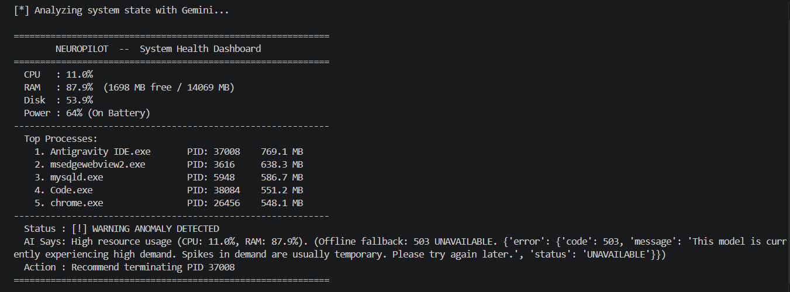
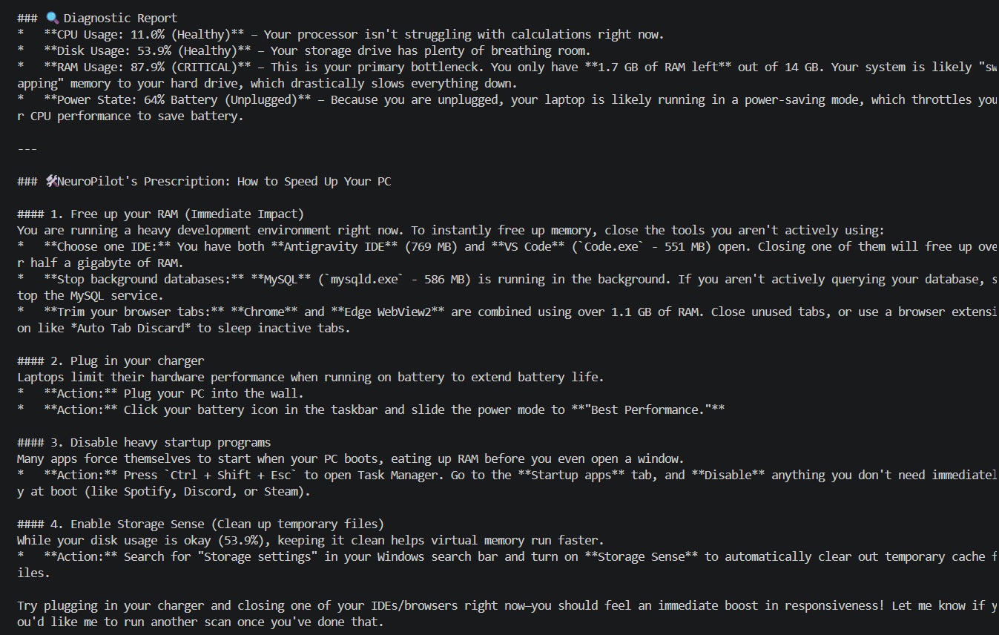
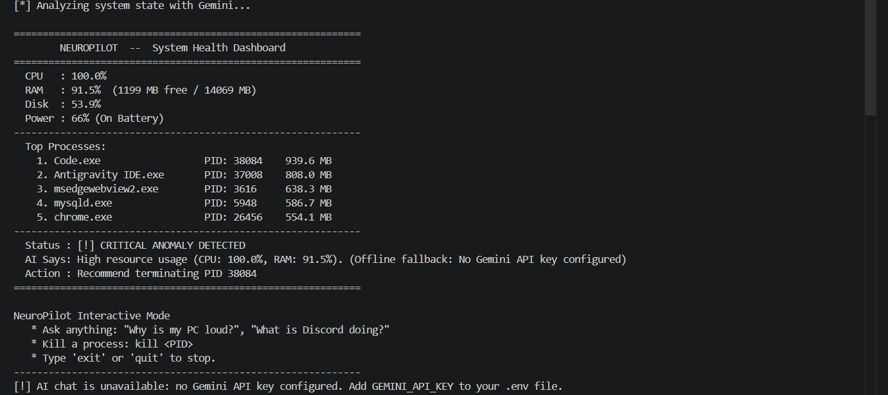

# ⚡ NeuroPilot — AI System Health Copilot (CLI)

**NeuroPilot** is a command-line copilot for Windows that reads live hardware telemetry (CPU, RAM, disk, battery, top processes), asks a cloud LLM (**Google Gemini**) whether something looks wrong, and lets you chat about your PC in plain English or terminate a misbehaving process, with safeguards.

> **Built with AI assistance** (design discussion, debugging, and boilerplate). I reviewed and tested the code, and the architecture notes below explain the decisions.

## Screenshots

**Dashboard** (Gemini was overloaded here, so the rule-based fallback took over):



**AI chat**: answers are based on the live telemetry (real processes, real RAM pressure):



**Offline fallback** (no API key configured): the dashboard still works and chat is disabled with a clear message:



---

## Features

- **Live dashboard**: CPU, RAM, disk, battery and the top 5 processes by memory.
- **AI diagnosis**: telemetry is sent to Gemini, which returns structured JSON (`is_anomaly`, `severity`, `reason`, `recommended_action`).
- **Offline fallback**: if the API is unreachable or returns malformed output, a simple rule-based check (CPU/RAM > 85%) takes over.
- **Interactive chat**: ask things like *"Why is my PC loud?"* with your current telemetry as context.
- **Safe process termination**: `kill <PID>` or `kill <name>` from the prompt.

## Project Structure

```
neuropilot/
├── app.py            # CLI runner: dashboard + interactive prompt
├── brain.py          # Gemini integration: analysis, chat, rule-based fallback
├── monitor.py        # psutil telemetry + process termination with safeguards
├── config.py         # Thresholds and settings (reads secrets from environment)
├── docs/             # Screenshots used in this README
├── requirements.txt
└── .gitignore        # Keeps .env (your API key) out of git
```

## Quick Start

**Requirements:** Windows, Python 3.9+ (disk stats currently use `C:\`).

```powershell
git clone <your-repo-url>
cd neuropilot
pip install -r requirements.txt
```

Get a free API key from [Google AI Studio](https://aistudio.google.com/apikey), then create a file named `.env` in the project folder containing:

```env
GEMINI_API_KEY=your_api_key_here
```

Run it:

```powershell
python app.py
```

Inside the prompt:

| Input | Action |
|---|---|
| any question | Answered by Gemini using current telemetry |
| `kill <PID>` / `kill <name>` | Terminates the process (protected processes are refused) |
| `exit` / `quit` | Leaves the app |

## Testing Modules Individually

| Command | What it does |
|---|---|
| `python monitor.py` | Prints metrics and top processes, and exercises the termination safeguards (spawns and kills a test `cmd`/`notepad` process) |
| `python brain.py` | Runs a Gemini diagnosis on live telemetry, then opens the chat |
| `python app.py` | Runs the full copilot |

## Safety Design

An LLM should never be trusted to decide what gets killed on its own, so:

- The AI only **recommends** an action; termination happens only when **you** type `kill`.
- `monitor.py` refuses to terminate PIDs 0 and 4, its own process, and a list of critical Windows processes (`csrss.exe`, `lsass.exe`, `winlogon.exe`, `svchost.exe`, `explorer.exe`, and others).
- Termination tries a graceful `terminate()` first and only force-kills after a 3-second timeout.

## Security

- **Never commit your API key.** It is read from the `GEMINI_API_KEY` environment variable / `.env`, and `.env` is git-ignored.
- If a key was ever committed or shared, revoke it in Google AI Studio and create a new one.

## Known Limitations

- Windows-only for now (hardcoded `C:\` disk path and Windows process names).
- Top processes are ranked by **virtual memory size (VMS)**, which can overstate real usage; resident memory (RSS) would be a better measure.
- Requires internet access and a Gemini API key for AI features (the rule-based fallback works offline).
- Telemetry is sent to a third-party API; process names may be sensitive on some machines.

## Tech Stack

Python · psutil · Google Gemini (`google-genai`) · python-dotenv

## AI Assistance Used In
Built with AI assistance: I wrote monitor.py (system metrics and safe process termination) and part of brain.py. AI tools generated app.py, most of the remaining brain.py, and the initial project structure. I tested the whole project, reviewed the code, and suggested fixes and changes.
